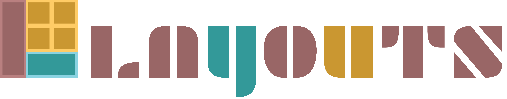

<p>
	
  <br>
  <a href="https://www.npmjs.com/package/svelte-layouts">
    
  </a>
  <a href="https://github.com/ryu-man/layouts/blob/main/LICENSE">
    
  </a>
<a href="https://bundlephobia.com/result?p=svelte-layouts">
  
</a>
  <a href="https://bundlephobia.com/result?p=svelte-layouts">
    
  </a>
</p>

# Layouts

This project is an implementation of css Flexbox & Grid for [svelte](https://svelte.dev/) framework

## Install

```bash
// npm
npm install svelte-layouts

// yarn
yarn add svelte-layouts
```

## Get started

Layouts have three main components: Row, Col (Column) and Grid.

_Note: svelte-layouts support type definitions_

## Row / Col

```html
<script>
    import { Row, Col } from 'svelte-layouts'
</script>

// control how elements are positioned horizontally
<Row justifyContent="space-between"></Row>

<Col></Col>
```

| Prop            | Type    |
| --------------- | ------- |
| justifyContent  | string  |
| alignItems      | string  |
| alignContent    | string  |
| wrap            | string  |
| inline          | boolean |
| reverse         | boolean |
| alignSelf       | string  |
| gap             | string  |
|                 |         |
| Flex item props |
| order           | string  |
| grow            | string  |
| shrink          | string  |
| basis           | string  |
| alignSelf       | string  |
| justifySelf     | string  |
|                 |         |
| Grid item props |
| alignSelf       | string  |
| justifySelf     | string  |
| colStart        | string  |
| colEnd          | boolean |
| rowStart        | boolean |
| rowEnd          | string  |
| col             | string  |
| row             | string  |
| area            | string  |
|                 |         |
| Other           |
| fluid           | string  |

## Grid

```html
<script>
    import { Grid } from 'svelte-layouts'
</script>

// Define the number & width of rows and columns
<Grid templateRows="auto" templateCols="20vw 1fr"></Grid>
```

| Prop            | Type    |
| --------------- | ------- |
| Grid props      |
| templateCols    | string  |
| templateRows    | string  |
| templateAreas   | string  |
| colGap          | string  |
| rowGap          | string  |
| autoCols        | string  |
| autoRows        | string  |
| justifyContent  | string  |
| alignItems      | string  |
| alignContent    | string  |
| alignSelf       | string  |
| wrap            | string  |
| inline          | boolean |
| reverse         | boolean |
|                 |         |
| Grid item props |
| alignSelf       | string  |
| justifySelf     | string  |
| colStart        | string  |
| colEnd          | boolean |
| rowStart        | boolean |
| rowEnd          | string  |
| col             | string  |
| row             | string  |
| area            | string  |
|                 |         |
| Flex item props |
| order           | string  |
| grow            | string  |
| shrink          | string  |
| basis           | string  |
| alignSelf       | string  |
| justifySelf     | string  |
|                 |         |
| Other           |
| fluid           | string  |

## Item

As You can use any HTML element in the content you can also use Item component which let you have more control over the element directly, each of Col, Row and Grid can be used as Flex/Grid items

```html
<script>
  import { Grid, Item, Row, Col } from 'svelte-layouts'
</script>

<Row>
    // Create div element, can't control directly
    <div></div>

    // Create a div item
    // you can use content props only
    <Item></Item>

    // Create a row item
    // you can use Row props + content props
    <Row></Row>

    // Create a Col item
    // you can use Column props + content props
    <Col></Col>

    // Create a grid item
    // you can use Grid props + content props
    <Grid></Grid>
</Row>

<Grid>
    // Create div element, can't controls directly
    <div></div>

    // Create a div grid item
    <Item></Item>

    // Create a row grid item 
    <Row></Row>

    // Create a column grid item
    <Col></Col>

    // Create a grid grid item 
    <Grid></Grid>
</Grid>
```

### Item Props

| Prop            | Type    |
| --------------- | ------- |
| Flex props      |
| order           | string  |
| grow            | string  |
| shrink          | string  |
| basis           | string  |
|                 |         |
| Grid Item props |         |
| alignSelf       | string  |
| justifySelf     | string  |
| colStart        | string  |
| colEnd          | boolean |
| rowStart        | boolean |
| rowEnd          | string  |
| col             | string  |
| row             | string  |
| area            | string  |
|                 |         |
| Other           |
| fluid           | string  |

## Responsive Design

```html
<div class="container">
  <Row class="custom-class"></Row>
</div>
```

```css
@media (min-width: 1000px) {
/*
you can target .col , .row, .grid, .item, also you can add .layout class to prevent style collision 
or you can target a specific  class provided to the component via it class prop
.class :global(.class) syntax is recommended to prevent style leakage
*/
  .container :global(.col) { 
    /*make sure to use !important to override component's inline style*/
    background-color: black !important;
  }
}
```

## License

svelte-layouts is [MIT Licenced](./LICENSE)

## Learn More

if you want to learn more about css flexbox and grid and how they works, you can feel free to check out these useful links:

- [A Complete Guide to Flexbox](https://css-tricks.com/snippets/css/a-guide-to-flexbox/)
- [A Complete Guide to Grid](https://css-tricks.com/snippets/css/complete-guide-grid/)
- [Flexbox vs Grid](https://dev.to/nadayousry/grid-vs-flexbox-3fbh)
  